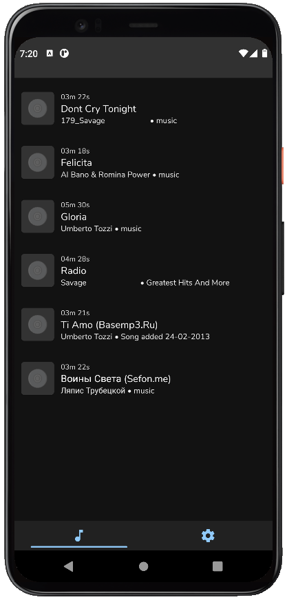
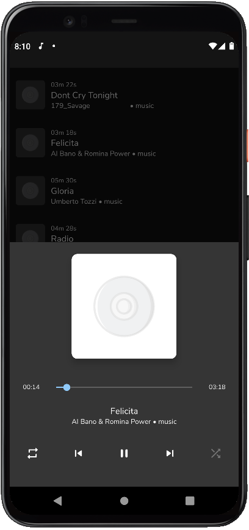

# Audio Player

Simplified version of Music Player.

Features:
-> Playback of popular audio formats such as MP3 and AAC
-> Create and manage playlists
-> Browse and search for music on the device
-> Control playback from the lock screen and notifications
-> Equalizer for adjusting sound settings

Functionality:
- The player allows getting a list of media files of the device, selecting any of them, and playing with the display of
  progress, the ability to scroll forward / backward and pause the media file.

- During an incoming call, and until the end of the call, playback is suspended with the resumption of progress after
  resuming playback.

- At the end of playback there is an automatic transition to the following file.

- Looping and random transition modes are supported

Installation:
To install and run the app, clone the repository and open in Android Studio. Then, connect an Android device and run the app on the device or use an emulator.

